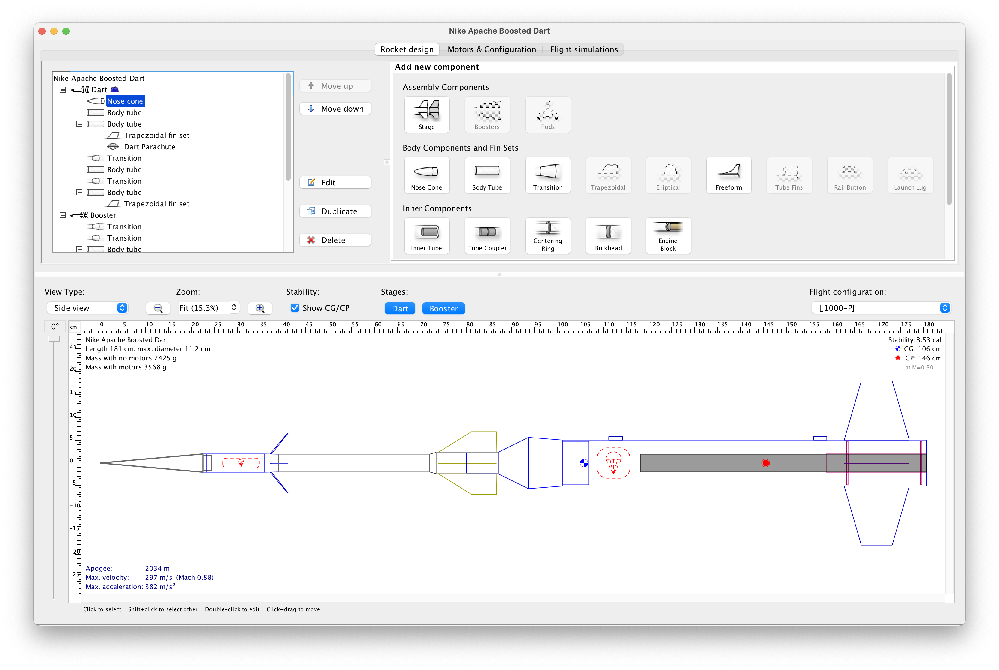
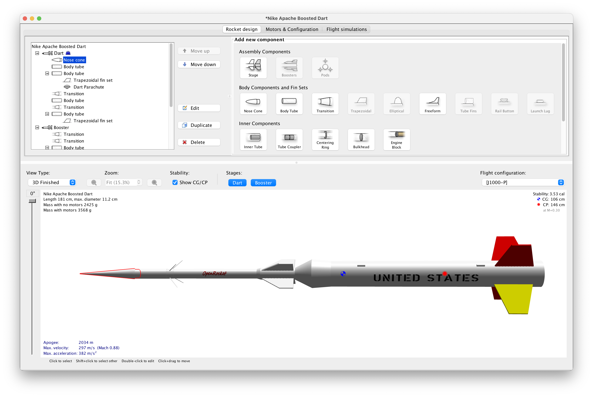
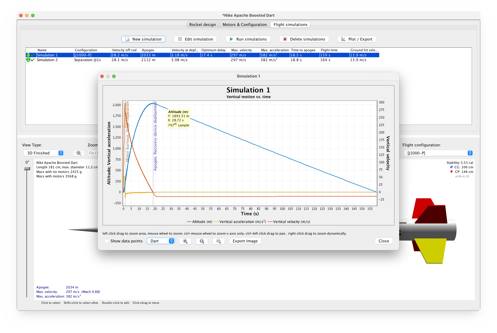

# OpenRocket 🚀

OpenRocket is a free, fully featured model rocket simulator that allows you to design and simulate your rockets before actually building and flying them.

--------

## 🛠️ Design, Visualize, and Analyze

1. **Design** your rockets using a rich selection of built-in components:
   

2. **Visualize** your masterpiece in 3D:
   

3. **Plot & Analyze** your simulation results for precision and improvements:
   

## 🌟 Features

- **Six-degree-of-freedom flight simulation**
- **Automatic design optimization**
- **Realtime simulated altitude, velocity, and acceleration display**
- **Staging and clustering support**
- **Cross-platform (Java-based)**

... plus many more

📖 Read more on the [OpenRocket Wiki](http://wiki.openrocket.info).

## 💾 Installers

Find the OpenRocket installers [here](https://openrocket.info/downloads.html)

## 📝 Release Notes

Release notes are available on each [release's page](https://github.com/openrocket/openrocket/releases) or on [our website](https://openrocket.info/release_notes.html).

## 💪 Contribute

Help us soar higher! Whether it's implementing features, writing documentation, or creating design examples, every contribution matters. Interested? Check out [how to get involved](http://openrocket.sourceforge.net/getinvolved.html) and the [practicalities of contributing](CONTRIBUTING.md).

### ✨ Contributors
- [Sampo Niskanen](https://github.com/plaa) - Original developer
- [Doug Pedrick](https://github.com/rodinia814) - RockSim designs, printing
- [Kevin Ruland](https://github.com/kruland2607) - Android version
- [Bill Kuker](https://github.com/bkuker) - 3D visualization
- [Richard Graham](https://github.com/rdgraham) - Geodetic computations
- Jason Blood - Freeform fin set import
- [Boris du Reau](https://github.com/bdureau) - Internationalization
- [Daniel Williams](https://github.com/teyrana) - Pod support, maintainer
- [Joe Pfeiffer](https://github.com/JoePfeiffer) - Maintainer
- [Billy Olsen](https://github.com/wolsen) - Maintainer
- [Sibo Van Gool](https://github.com/SiboVG) - RASAero file format, 3D OBJ export, dark theme, maintainer
- [Neil Weinstock](https://github.com/neilweinstock) - Tester, icons, forum support
- [H. Craig Miller](https://github.com/hcraigmiller) - Tester

You can view the full list of contributors [here](https://github.com/openrocket/openrocket/graphs/contributors).

### 🌍Translators
- Tripoli France
- Tripoli Spain
- Stefan Lobas / ERIG
- Mauro Biasutti
- Sky Dart Team / Ruslan V. Uss
- Vladimir Beran
- Polish Rocketry Society / Łukasz & Alex Kazanski
- Sibo Van Gool
- Mohamed Amin Elkebsi

## 📜 License

OpenRocket is proudly open-source under the [GNU GPL](https://www.gnu.org/licenses/gpl-3.0.en.html) license. Feel free to use, study, and extend.

---
 
⭐ Please give us a star if you find OpenRocket useful, and spread the word! ⭐

