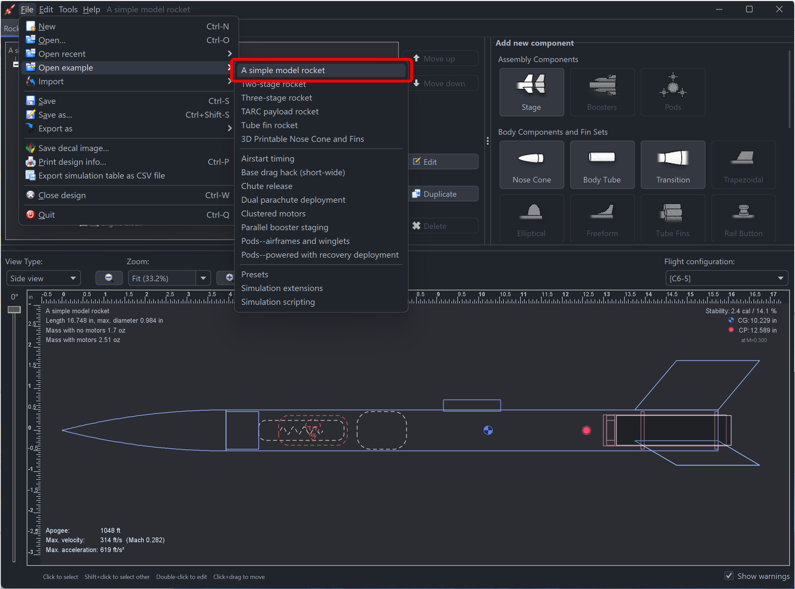

# OpenRocket 🚀

OpenRocket is a free, fully featured model rocket simulator that allows you to design and simulate your rockets before actually building and flying them.

--------

## 🛠️ Design, Visualize, and Analyze

1. **Design** your rockets using a rich selection of built-in components:
   

2. **Visualize** your masterpiece in 3D:
   

3. **Plot & Analyze** your simulation results for precision and improvements:
   

## 🌟 Features

- **Six-degree-of-freedom flight simulation**
- **Automatic design optimization**
- **Realtime simulated altitude, velocity, and acceleration display**
- **Staging and clustering support**
- **Export to other simulation programs (RockSim, RASAero II)**
- **Export component(s) to OBJ file for 3D printing**
- **Cross-platform (Java-based)**

... plus many more

📖 Read more on [our website](https://openrocket.info/).

## 💾 Installers

You can find the OpenRocket installers [here](https://openrocket.info/downloads.html).

Release notes are available on each [release's page](https://github.com/openrocket/openrocket/releases) or on [our website](https://openrocket.info/release_notes.html).

## 📖 Documentation

You can find our documentation on [ReadTheDocs](https://openrocket.readthedocs.io/en/latest/).

## 🚀 Getting started

**Check out [our documentation](https://openrocket.readthedocs.io/en/latest/setup/getting_started.html) for a detailled guide on how to get started.**

The easiest way to get familiar with OpenRocket is to open one of our in-program example designs:

Dive into the essentials: adjust component dimensions, plot a simulation, swap out motors, ... Explore the impact of your changes and, most importantly, enjoy the process! 😊

## 📐 OpenRocket – Related Projects & Tools
*Note: If you have an OpenRocket-related project you would like included in the list, you can file a new issue for it.*

### Core Projects
| Project                                                                               | Type             | Description                                                    |
|---------------------------------------------------------------------------------------|------------------|----------------------------------------------------------------|
| [openrocket/openrocket](https://github.com/openrocket/openrocket)                     | Core project     | Main simulator (Java)                                          |
| [openrocket/openrocket.github.io](https://github.com/openrocket/openrocket.github.io) | Website source   | Website content (Jekyll)                                       |
| [openrocket/openrocket-database](https://github.com/openrocket/openrocket-database)   | Data enhancement | Expanded parts catalog (originally dbcook/openrocket-database) |

### Integration & Scripting
| Project                                                                                 | Type                       | Description                                                                         |
|-----------------------------------------------------------------------------------------|----------------------------|-------------------------------------------------------------------------------------|
| [openrocket/orhelper](https://github.com/openrocket/orhelper)                           | Integration (Python)       | Python scripting/module for OpenRocket (via JPype) (forked from SilentSys/orhelper) |
| [RocketPy-Team/RocketSerializer](https://github.com/RocketPy-Team/RocketSerializer)     | Integration (Python)       | Convert `.ork` files to RocketPy-compatible formats                                 |
| [SpaceTeam/ortools](https://github.com/SpaceTeam/ortools)                               | Integration Tools (Python) | Scripts like 6DOF landing scatter visualization                                     |
| [schrum2/OpenRocketQD](https://github.com/schrum2/OpenRocketQD)                         | Optimization tool (Python) | Quality Diversity optimization for rocket designs                                   |
| [waterloo-rocketry/or-monte-carlo](https://github.com/waterloo-rocketry/or-monte-carlo) | Simulation tool (Java)     | Monte Carlo simulation wrapper for OpenRocket                                       |

### Engine & Aerodynamics Extensions
| Project                                                              | Type                     | Description                            |
|----------------------------------------------------------------------|--------------------------|----------------------------------------|
| [SpaceTeam/ORLEG](https://github.com/SpaceTeam/ORLEG)                | Engine modeling (Python) | Liquid-engine generator for OpenRocket |
| [WPI-HPRC/ORBrake](https://github.com/WPI-HPRC/ORBrake) *(archived)* | Plugin (Java)            | Active drag control (air-brakes)       |

### Wind & Atmospheric Data
| Project                                    | Type                     | Description                                                                          |
|--------------------------------------------|--------------------------|--------------------------------------------------------------------------------------|
| [ORWind](https://gpsdriftcast.com/orwind/) | Atmospheric data utility | Fetches/imports multi-level wind data for OpenRocket                                 |
| [Aloft](https://aloft.onrender.com/)       | Weather data utility     | Retrieves weather/atmospheric profiles (winds, temp, pressure) for flight simulation |

### Design & CAD Integration
| Project                                                               | Type          | Description                                                                   |
|-----------------------------------------------------------------------|---------------|-------------------------------------------------------------------------------|
| [FreeCAD Rocket Workbench](https://github.com/davesrocketshop/Rocket) | CAD workbench | A rocket design workbench for FreeCAD that can import OpenRocket `.ork` files |

### Example Designs / Showcase
| Project                                                                           | Type            | Description             |
|-----------------------------------------------------------------------------------|-----------------|-------------------------|
| [TrinetraOne-OpenRocket](https://github.com/ChinmayBhattt/TrinetraOne-OpenRocket) | Example designs | Showcase rocket project |

## 💪 Contribute

Help us soar higher! Whether it's implementing features, writing documentation, or creating design examples, every contribution matters. Interested? Check out [how to get involved](https://openrocket.info/contribute.html) and the [practicalities of contributing](CONTRIBUTING.md).

### ✨ Contributors
- [Sampo Niskanen](https://github.com/plaa) - Original developer
- [Doug Pedrick](https://github.com/rodinia814) - RockSim designs, printing
- [Kevin Ruland](https://github.com/kruland2607) - Android version
- [Bill Kuker](https://github.com/bkuker) - 3D visualization
- [Richard Graham](https://github.com/rdgraham) - Geodetic computations
- Jason Blood - Freeform fin set import
- [Boris du Reau](https://github.com/bdureau) - Internationalization
- [Daniel Williams](https://github.com/teyrana) - Pod support, maintainer
- [Joe Pfeiffer](https://github.com/JoePfeiffer) - Maintainer
- [Billy Olsen](https://github.com/wolsen) - Maintainer
- [Sibo Van Gool](https://github.com/SiboVG) - RASAero file format, 3D OBJ export, dark theme, maintainer
- [Neil Weinstock](https://github.com/neilweinstock) - Tester, icons, forum support
- [H. Craig Miller](https://github.com/hcraigmiller) - Tester

You can view the full list of contributors [here](https://github.com/openrocket/openrocket/graphs/contributors).

### 🌍Translators
- Tripoli France
- Tripoli Spain
- Stefan Lobas / ERIG
- Mauro Biasutti
- Sky Dart Team / Ruslan V. Uss
- Vladimir Beran
- Polish Rocketry Society / Łukasz & Alex Kazanski
- Sibo Van Gool
- Mohamed Amin Elkebsi
- Oleksandr Hladin

## 📜 License

OpenRocket is proudly open-source under the [GNU GPL](https://www.gnu.org/licenses/gpl-3.0.en.html) license. Feel free to use, study, and extend.

---
 
⭐ Please give us a star if you find OpenRocket useful, and spread the word! ⭐

